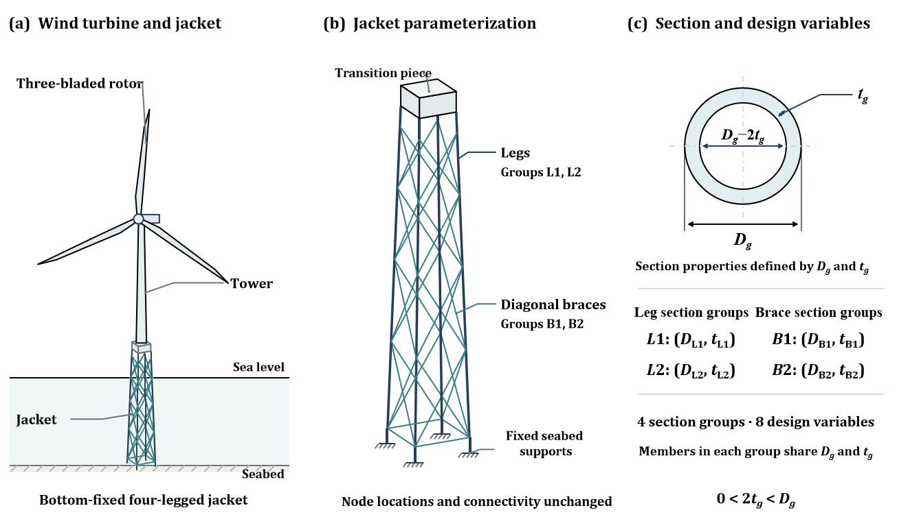
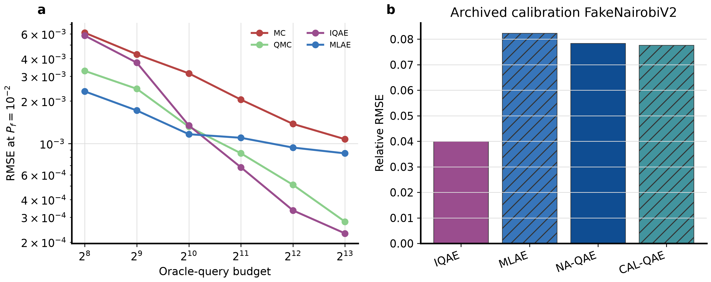
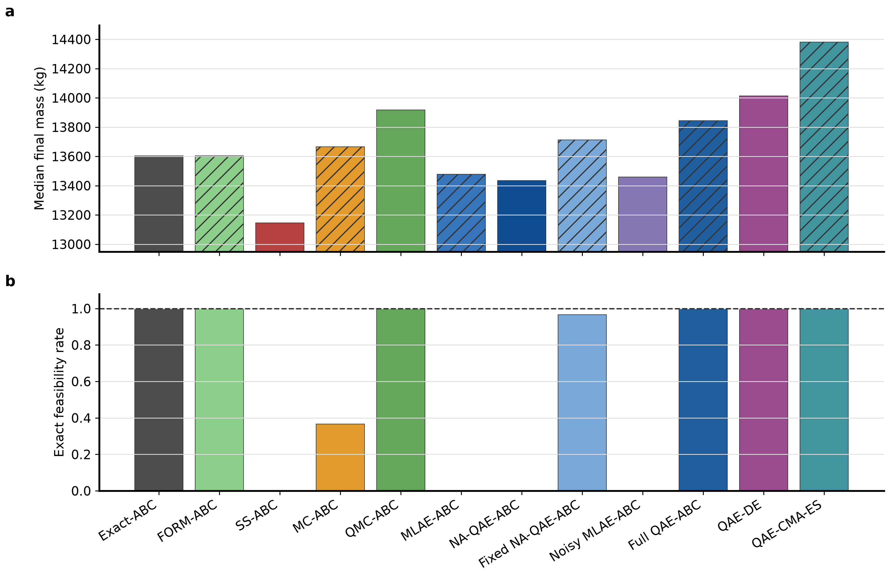
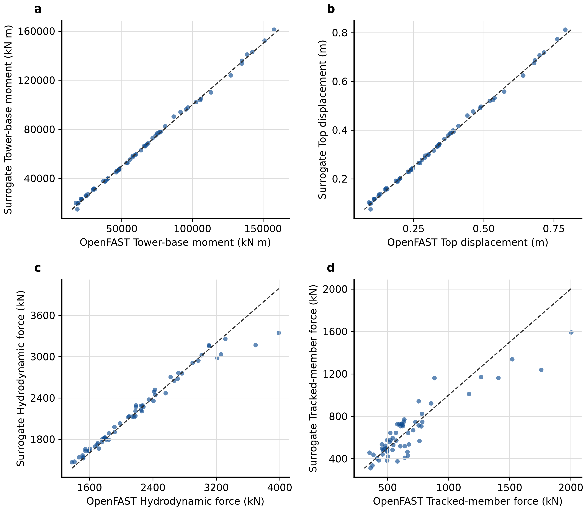
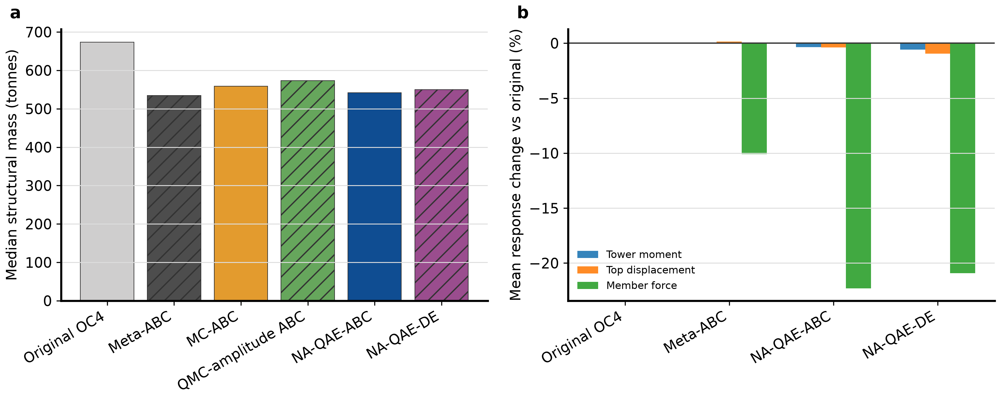
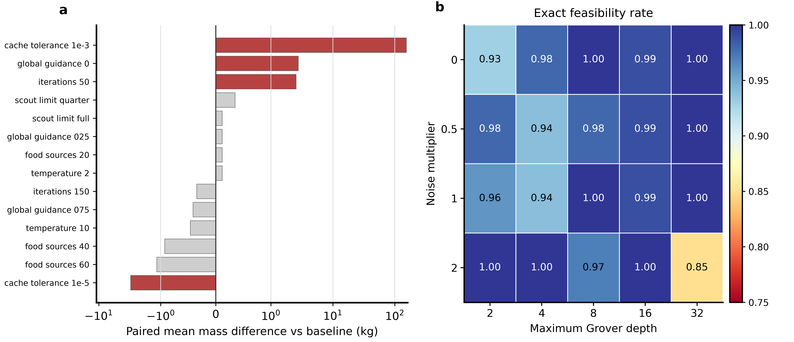
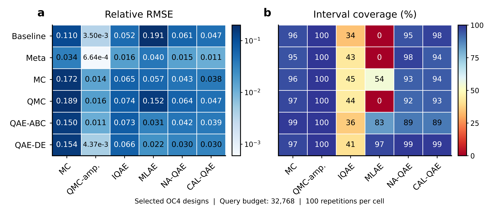

# QAE-ABC

### Quantum amplitude estimation-assisted reliability-constrained optimization of offshore wind turbine jackets

[Method](#method-at-a-glance) · [Results](#experimental-evidence) · [Figures](#manuscript-figures) · [Experiments](#experimental-design) · [Data](#datasets-and-result-workbooks) · [Reproduction](#reproduction) · [Structure](#repository-structure)

QAE-ABC connects historical wind and wave records, multi-fidelity structural-response models, quantum amplitude estimation (QAE), and artificial bee colony (ABC) search for reliability-constrained offshore jacket design. Probability intervals guide candidate ranking and adaptive query allocation. Analytic benchmarks, reversible quantum circuits, a 10-bar truss, and the OC4 jacket connect estimator behavior to structural optimization and independent design assessment.

This repository provides the computational package, **13 main experiment entry points**, **four fitted model bundles**, **18 Parquet datasets**, **28 curated result workbooks**, and **14 manuscript figures in PNG and PDF formats**. Raw environmental download caches and additional research figures are also included. The engineering optimization loop uses scalar-probability amplitude simulation; separate functional-circuit experiments assess the quantum implementation. Short-window response screening is followed by selected-design dynamic assessment.

## At a glance

| Item | Study configuration |
| --- | --- |
| Primary task | Minimize structural mass under a modeled failure-probability constraint |
| Structural benchmark | 10-bar truss with four cross-sectional-area groups |
| Engineering case | OC4 bottom-fixed jacket, with four diameter/thickness groups and eight design variables |
| Main environmental record | North Sea, 54.0 degrees N / 6.5 degrees E, 2000–2024 |
| Environmental sample size | 219,168 hourly rows; 218,136 complete-core records |
| Observation cross-check | NDBC 44025, 2014–2023; 81,459 time-paired rows, not colocated with the North Sea site |
| Engineering response samples | 5,000 LF cases and 400 short-window HF cases |
| Reliability metamodel | 1,500 designs evaluated over 8,192 historical environments each |
| Final dynamic checks | Four selected designs x three wave seeds; 12 runs of 600 s |
| Quantum evidence | Scalar-amplitude simulations, ideal functional circuits, calibrated-noise simulations and compiled resources |
| Hardware status | No real-QPU execution is claimed |
| Manuscript figures | [Figure 1–14 index](#manuscript-figures) · [PNG previews](Figures/) · [PDF files](Figures/pdf/) |
| Research data | [Dataset guide](datasets/DATASET.md) · [Fixed Google Drive download](https://drive.google.com/drive/folders/1Md0APmG8a8DiTAL7MSG1-5Nc7lLaEEDF) |

## Research question

A probability estimator can have a small average error while still producing unreliable decisions near a feasibility boundary. During optimization, repeated selection can amplify optimistic estimation errors: an apparently lightweight design may be selected because its failure probability was underestimated.

The study examines the following proposition:

> Probability-estimation accuracy should be evaluated together with interval coverage, selection behavior, and independently checked design feasibility—not only as a stand-alone RMSE improvement.

The evidence follows four connected questions: how estimators behave under controlled probabilities, whether the quantum components implement the intended failure logic, how estimation errors affect structural search, and what changes when the workflow is transferred to surrogate-assisted offshore engineering.

## Method at a glance

[](Figures/pdf/Figure2.pdf)

*Figure 2. Historical environmental records support engineering response models and reliability labels. ABC proposes designs, while probability estimates and intervals inform candidate ranking. Click the figure to open its PDF.*

The workflow combines six components:

1. **Environmental characterization.** Preserve hourly records, fit-period and temporal-test partitions, marginal/dependence information, and variable-specific observation checks.
2. **Structural response modeling.** Use finite elements for the truss and LF/OpenFAST samples for OC4, followed by response-specific surrogate evaluation.
3. **Probability estimation.** Compare classical sampling, QAE-family estimators, interval coverage, query accounting and controlled-noise behavior.
4. **Confidence-aware ABC search.** Rank and update candidate designs using reliability estimates and uncertainty information under a mass objective.
5. **Refinement and mechanism checks.** Separate the effects of confidence selection, adaptive precision, noise treatment, lookup logic and active/endpoint refinement.
6. **Independent assessment.** Examine exact truss probabilities, held-out designs, temporal environments, and selected-design dynamic responses.

The generic design problem is:

$$
\min_{\mathbf d\in\mathcal D} M(\mathbf d)
\quad\text{subject to}\quad
P_f(\mathbf d)=\Pr[g(\mathbf d,\boldsymbol\xi)\leq 0]\leq p_{\mathrm{target}}.
$$

Here, the design domain, limit states and reliability labels are case-specific. The full truss variant includes exact-probability endpoint refinement; its results must not be attributed solely to the QAE estimator. OC4 reliability labels are surrogate-based system-response exceedances under the stated operating-environment and calibrated-capacity definitions.

Core implementations are in [optimization/abc.py](algorithm/qae_abc/optimization/abc.py), [quantum/likelihood.py](algorithm/qae_abc/quantum/likelihood.py), [quantum/functional_oracle.py](algorithm/qae_abc/quantum/functional_oracle.py), and [reliability/oc4.py](algorithm/qae_abc/reliability/oc4.py).

### Engineering parameterization

[](Figures/pdf/Figure1.pdf)

*Figure 1. Four member groups define eight diameter/thickness variables while retaining the jacket topology. [Figure 3](Figures/pdf/Figure3.pdf) details the scalar-probability amplitude-estimation interface used within the engineering search.*

## Experimental evidence

The previews below use the manuscript figure set in [`Figures/`](Figures/). Click a preview to open its corresponding PDF; the [complete figure index](#manuscript-figures) includes all 14 PNG/PDF pairs.

### Probability estimation and structural decisions

<table>
<tr>
<td width="50%"><a href="Figures/pdf/Figure7.pdf"></a></td>
<td width="50%"><a href="Figures/pdf/Figure10.pdf"></a></td>
</tr>
<tr>
<td><strong>Figure 7 · Probability estimation.</strong> Query-budget convergence and simulated-noise comparisons characterize estimation accuracy.</td>
<td><strong>Figure 10 · Truss optimization.</strong> Endpoint mass is assessed together with exact feasibility across twelve algorithm configurations.</td>
</tr>
</table>

The analytic and nonlinear studies compare estimation rather than assuming that an asymptotic query argument guarantees practical advantage. The truss comparisons and ablations then test whether estimator behavior translates into sound design selection. Confidence treatment and endpoint refinement are distinct contributors, so the repository retains their separate evidence.

See the [analytic table](data/4-3-1-1.xlsx), [nonlinear table](data/4-3-1-2.xlsx), [truss comparison](data/4-3-3-1.xlsx), and [ablation table](data/4-3-3-2.xlsx).

### Engineering response and design assessment

<table>
<tr>
<td width="50%"><a href="Figures/pdf/Figure6.pdf"></a></td>
<td width="50%"><a href="Figures/pdf/Figure14.pdf"></a></td>
</tr>
<tr>
<td><strong>Figure 6 · Response models.</strong> Predictions are compared with OpenFAST for each structural-response quantity.</td>
<td><strong>Figure 14 · Engineering outcomes.</strong> Optimization mass and selected-design response changes connect lightweight design to dynamic assessment.</td>
</tr>
<tr>
<td width="50%"><a href="Figures/pdf/Figure12.pdf"></a></td>
<td width="50%"><a href="Figures/pdf/Figure13.pdf"></a></td>
</tr>
<tr>
<td><strong>Figure 12 · Design selection.</strong> Search settings and estimation error are examined for their effects on structural decisions.</td>
<td><strong>Figure 13 · Jacket probability estimates.</strong> Relative error and interval coverage are compared across representative designs.</td>
</tr>
</table>

The functional-circuit experiment constructs and executes a **42-logical-qubit** circuit using ideal Aer matrix-product-state simulation, with 100 repetitions and an actual query budget of 8,192. This supports circuit-level simulation evidence, not a real-device demonstration. The separate OC4 functional-oracle study reports approximation and compilation behavior; its engineering acceptance must be assessed independently of whether the circuit was successfully built.

The 400 HF cases are **10 s screening runs**. The final 12 cases run for 600 s, with the first 120 s excluded from response analysis. These are limited dynamic checks—not a complete fatigue, design-load-case or certification campaign.

See [functional-circuit results](data/4-3-2-1.xlsx), [calibrated-noise results](data/4-3-2-2.xlsx), [OC4 oracle resources](data/4-3-2-3.xlsx), [surrogate results](data/4-3-4-1.xlsx), [OC4 optimization](data/4-3-4-3.xlsx), and [dynamic validation](data/4-3-4-5.xlsx).

## Manuscript figures

The [`Figures/`](Figures/) directory follows manuscript numbering from **Figure 1 to Figure 14**. PNG files provide browser previews; the matching files in [`Figures/pdf/`](Figures/pdf/) are available for publication and LaTeX use. Each row below links both formats of the same figure.

| Figure | Contents | PNG | PDF |
| --- | --- | --- | --- |
| 1 | Offshore jacket configuration and section design variables | [PNG](Figures/Figure1-Structure.png) | [PDF](Figures/pdf/Figure1.pdf) |
| 2 | Engineering evaluation and QAE-ABC optimization framework | [PNG](Figures/Figure2-Framework.png) | [PDF](Figures/pdf/Figure2.pdf) |
| 3 | Scalar-probability amplitude estimation in the engineering optimization loop | [PNG](Figures/Figure3-QAE-ABC.png) | [PDF](Figures/pdf/Figure3.pdf) |
| 4 | Historical wind–wave distributions, dependence and upper-tail quantiles | [PNG](Figures/Figure4-Dataset.png) | [PDF](Figures/pdf/Figure4.pdf) |
| 5 | Cross-platform channel comparison with the OpenFAST reference | [PNG](Figures/Figure5.png) | [PDF](Figures/pdf/Figure5.pdf) |
| 6 | Response-surrogate predictions compared with OpenFAST results | [PNG](Figures/Figure6.png) | [PDF](Figures/pdf/Figure6.pdf) |
| 7 | Probability-estimation convergence and simulated-noise comparisons | [PNG](Figures/Figure7.png) | [PDF](Figures/pdf/Figure7.pdf) |
| 8 | Estimation error versus query budget at four probability scales | [PNG](Figures/Figure8.png) | [PDF](Figures/pdf/Figure8.pdf) |
| 9 | Jacket optimization, truss comparisons and algorithm ablations | [PNG](Figures/Figure9.png) | [PDF](Figures/pdf/Figure9.pdf) |
| 10 | Truss endpoint mass and exact feasibility across twelve configurations | [PNG](Figures/Figure10.png) | [PDF](Figures/pdf/Figure10.pdf) |
| 11 | Algorithm-component effects and exact endpoint correction | [PNG](Figures/Figure11.png) | [PDF](Figures/pdf/Figure11.pdf) |
| 12 | Search-parameter sensitivity and estimation effects on design selection | [PNG](Figures/Figure12.png) | [PDF](Figures/pdf/Figure12.pdf) |
| 13 | Estimator error and interval coverage for representative jacket designs | [PNG](Figures/Figure13.png) | [PDF](Figures/pdf/Figure13.pdf) |
| 14 | Optimized jacket mass and longer-duration response changes | [PNG](Figures/Figure14.png) | [PDF](Figures/pdf/Figure14.pdf) |

The existing [`images/`](images/README.md) collection retains additional experiment plots and earlier figure layouts. Its `Fig-*` filenames use a separate numbering scheme; use the index above when matching figures to the manuscript.

## Experimental design

### Four evidence modules

| Module | Question | Evidence |
| --- | --- | --- |
| I. Probability estimation | How do error, coverage and query use vary? | Analytic and nonlinear benchmarks |
| II. Quantum implementation | Does the constructed logic represent the intended event, and at what resource cost? | Functional circuits, calibration-snapshot noise and OC4 oracle resources |
| III. Structural optimization | Do probability estimates support feasible, low-mass decisions? | Truss comparisons, ablation and sensitivity |
| IV. Engineering transfer | Does the workflow remain useful under modeled environmental and response uncertainty? | OC4 surrogates, reliability, optimization and validation |

### Selected protocol settings

| Setting | Value / scope |
| --- | --- |
| Analytic target probabilities | 0.1, 0.01, 0.001, 0.0001 |
| Analytic query budgets | 256, 512, 1,024, 2,048, 4,096, 8,192 |
| Analytic/nonlinear stochastic repetitions | 100 per configured cell |
| Nonlinear reference audit | 2^24 Sobol points per setting |
| Confidence level | 0.95 in the retained baseline configurations |
| Truss independent runs | 30 |
| Truss ABC food sources / iterations | 30 / 100 |
| Truss target reliability index | 3.0 |
| Truss adaptive query budgets | 512, 2,048, 8,192 |
| North Sea temporal partition | Fit: 2000–2019; temporal evaluation: 2020–2024 |
| OC4 response evaluation | 340 training cases and 60 frozen holdout cases |
| OC4 reliability evaluation | 1,200 training designs and 300 holdout designs |

These settings belong to different experimental layers; there is no single interchangeable budget for every experiment. Consult [configs/](experiments/configs/) and the relevant script for its precise protocol. The 1,500 x 8,192 design-environment combinations are surrogate evaluations, not that many OpenFAST runs.

### Main experiment entry points

| Entry | Contents |
| --- | --- |
| [E1-analytic.py](experiments/source/E1-analytic.py) | Analytic probability-estimator benchmark |
| [E2-nonlinear.py](experiments/source/E2-nonlinear.py) | Nonlinear estimator comparison |
| [E3-circuit.py](experiments/source/E3-circuit.py) | Functional-circuit QAE |
| [E4-noise.py](experiments/source/E4-noise.py) | Calibrated-noise simulation |
| [E5-truss.py](experiments/source/E5-truss.py) | Main truss optimizer comparison |
| [E6-ablation.py](experiments/source/E6-ablation.py) | Confidence, refinement and lookup ablations |
| [E7-sensitivity.py](experiments/source/E7-sensitivity.py) | QAE parameter sensitivity |
| [E8-surrogate.py](experiments/source/E8-surrogate.py) | OC4 multifidelity response models |
| [E9-reliability.py](experiments/source/E9-reliability.py) | OC4 reliability labels and metamodels |
| [E10-oc4.py](experiments/source/E10-oc4.py) | OC4 reliability-constrained optimization |
| [E11-estimation.py](experiments/source/E11-estimation.py) | Estimators for selected OC4 designs |
| [E12-oracle.py](experiments/source/E12-oracle.py) | OC4 functional-oracle construction and resources |
| [E13-validation.py](experiments/source/E13-validation.py) | Analysis of existing 600 s validation runs |

The numbering identifies the retained source entry points, not experiment completion percentages. The original shared helpers and supplementary historical scripts are outside this compact release; `experiments/common/` is not included. See [experiments/README.md](experiments/README.md) for dependencies and the original-to-current filename mapping.

## Repository structure

```text
QAE-ABC/
├── algorithm/
│   ├── qae_abc/        # Optimization, reliability, quantum and structural code
│   ├── models/         # Four fitted joblib bundles
│   └── README.md
├── experiments/
│   ├── source/         # E1-analytic.py through E13-validation.py
│   ├── configs/        # Retained study configurations
│   ├── tests/          # Computational tests
│   └── README.md
├── datasets/
│   ├── raw/            # Compressed environmental source caches
│   ├── processed/      # Hourly metocean and observation-validation records
│   ├── Truss10/        # Truss design-realization samples
│   ├── OC4/            # Engineering samples and reliability labels
│   └── DATASET.md
├── data/
│   ├── 4-*.xlsx        # 15 main-result workbooks
│   └── supplement/     # 13 supplementary workbooks
├── Figures/
│   ├── Figure*.png     # 14 manuscript figures for browser previews
│   └── pdf/            # Matching Figure1.pdf through Figure14.pdf
├── images/
│   ├── png/            # Additional plots and earlier figure layouts
│   ├── pdf/            # Corresponding existing PDF figures
│   ├── supplement/     # Additional figures
│   └── README.md
├── requirements.txt
├── .gitignore
└── README.md
```

## Datasets and result workbooks

### Research data

[Download the datasets from Google Drive](https://drive.google.com/drive/folders/1Md0APmG8a8DiTAL7MSG1-5Nc7lLaEEDF)

The fixed folder link is provided by the project owner. It is a distribution location, not an immutable version or DOI; remote access permissions and file parity have not been verified. The local research datasets are also included in this repository.

The [dataset guide](datasets/DATASET.md) documents all 18 Parquet files, variable definitions, stored-versus-valid row counts, alias files, temporal/design splits and five read-only Python examples. In particular:

- Truss records share designs; keep all realizations of a design in the same split.
- The 400-case OC4 table already includes the initial 300 and added 100 cases; do not concatenate them twice.
- Reliability holdout tables have 1,500 indexed rows but only 300 non-null predictions per held-out prediction column.
- NDBC checks are not colocated validation of the North Sea engineering environment.
- Frozen response-holdout IDs and some calibration artifacts remain in the original project rather than this dataset directory.

### Result workbooks

The [data/](data/) directory contains **15 main tables** and [supplement/](data/supplement/) contains **13 supplementary tables**. Each workbook has one worksheet, English headers and white cell backgrounds. Values, missing cells and numeric formatting are preserved.

| Number group | Contents |
| --- | --- |
| 4-1-1 to 4-1-3 | Environmental distributions, dependence and observations |
| 4-3-1-1 to 4-3-1-2 | Analytic and nonlinear estimation |
| 4-3-2-1 to 4-3-2-3 | Functional circuits, calibrated noise and OC4 oracle resources |
| 4-3-3-1 to 4-3-3-2 | Truss comparison and ablation |
| 4-3-4-1 to 4-3-4-5 | OC4 surrogates, reliability, optimization, estimation and dynamic checks |
| S1–S5 | Supplementary convergence, statistics, resources, sensitivity and validation |

### Saved models

| Model | Role |
| --- | --- |
| [reliability.joblib](algorithm/models/oc4_optimization/reliability.joblib) | OC4 design-level reliability models |
| [response.joblib](algorithm/models/oc4_surrogates/response.joblib) | OC4 multifidelity response models |
| [hgbr.joblib](algorithm/models/truss_surrogate/hgbr.joblib) | Truss reference gradient-boosting surrogate |
| [pce.joblib](algorithm/models/truss_surrogate/pce.joblib) | Sparse polynomial-chaos truss surrogate |

Serialized models require compatible libraries and project classes. Load only trusted joblib files. The [algorithm guide](algorithm/README.md) records historical filenames and explains why original script defaults may differ.

## Installation

Clone the repository and create an isolated Python environment:

```bash
git clone https://github.com/Lutra11/QAE-ABC.git
cd QAE-ABC
python -m venv .venv
```

Windows PowerShell:

```powershell
.\.venv\Scripts\python.exe -m pip install -r requirements.txt
.\.venv\Scripts\Activate.ps1
$env:PYTHONPATH = "$PWD\algorithm"
```

Linux or macOS:

```bash
source .venv/bin/activate
python -m pip install -r requirements.txt
export PYTHONPATH="$PWD/algorithm"
```

The requirements list covers the research Python stack; it is not a version lock. OpenFAST executables, regression model inputs and all original runtime artifacts are **not** bundled by this installation. Numerical, quantum-simulation and engineering workloads have different runtime requirements.

## Reproduction

Run commands from the repository root.

### 1. Inspect the packaged code and data

```bash
python -c "import qae_abc; print(qae_abc.__file__)"
python -c "import pandas as pd; d = pd.read_parquet('datasets/Truss10/truss_doe_full.parquet'); print(d.groupby('split').size())"
```

The second command should report 5,600 training, 1,190 validation and 1,210 test rows. Follow [DATASET.md](datasets/DATASET.md) for the environmental, engineering and reliability examples.

### 2. Check the computational tests

```bash
python -m pytest experiments/tests -q -p no:cacheprovider
```

The earlier local verification passed 35 tests with shared helper modules and the original OpenFAST SubDyn model available. Those helpers are no longer included in this publication snapshot: OC4 test collection and some experiment imports require them to be restored or explicitly provided from the original project. The historical pass is not a claim that a fresh clone passes the full suite.

### 3. Inspect a main experiment

```bash
python experiments/source/E1-analytic.py --help
```

Interfaces differ between scripts. Some entry points have no argument parser and can start computation even when passed `--help`; inspect their code before invoking them. E13 analyzes and writes summaries of existing validation runs rather than launching a new campaign.

### 4. Restore the original runtime contract before formal reruns

The retained implementations preserve historical input/output defaults designed for the original `src/data/results/external` project. This reorganized package is **not an out-of-the-box reconstruction of that complete workspace**. Formal reproduction requires the missing shared helper modules (including `run_openfast_oc4_doe` and `run_oc4_low_fidelity_doe`), frozen case IDs, capacities, calibration/model metadata, external tools and path configuration.

Use an isolated workspace, explicitly map current model filenames to the required inputs, and write new results separately from the curated workbooks. Do not reinterpret a newly chosen split or a smoke run as reproduction of the reported experiment.

## License

The original project code is released under the [MIT License](LICENSE).
