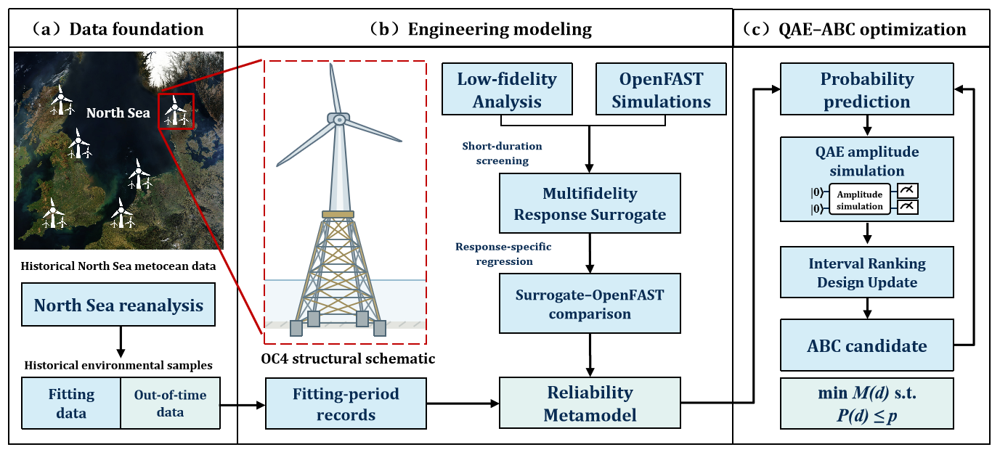

# Research figures

Existing figures are grouped by PNG, PDF, and supplementary material. Figure names and plot data are unchanged. This package currently has no top-level SVG directory.

## Overall framework

[Framework PNG](png/Framework.png) · [Framework PDF](pdf/Framework_thesis.pdf) · [Structural schematic](png/Structure.png)

## Main figures

| Figure | Content | PNG | PDF |
| --- | --- | --- | --- |
| Fig-1 | Research workflow | [PNG](png/Fig-1.png) | [PDF](pdf/fig01_research_workflow.pdf) |
| Fig-2 | Metocean dependence | [PNG](png/Fig-2.png) | [PDF](pdf/fig02_metocean_dependence.pdf) |
| Fig-3 | Platform comparison | [PNG](png/Fig-3.png) | [PDF](pdf/fig03_openfast_platform_equivalence.pdf) |
| Fig-4 | Estimator evidence | [PNG](png/Fig-4.png) | [PDF](pdf/fig04_qae_estimator_evidence.pdf) |
| Fig-5 | Optimizer comparison | [PNG](png/Fig-5.png) | [PDF](pdf/fig05_extended_optimization.pdf) |
| Fig-6 | Sensitivity | [PNG](png/Fig-6.png) | [PDF](pdf/fig06_sensitivity.pdf) |
| Fig-7 | Response-surrogate parity | [PNG](png/Fig-7.png) | [PDF](pdf/fig07_oc4_surrogate_parity.pdf) |
| Fig-8 | Engineering optimization and validation | [PNG](png/Fig-8.png) | [PDF](pdf/fig08_oc4_optimization_validation.pdf) |
| Fig-9 | Estimation and circuit resources | [PNG](png/Fig-9.png) | [PDF](pdf/fig09_oc4_quantum_evidence.pdf) |

Other retained figures are in `supplement/`, grouped by their original topics. Detailed plot-input hashes remain in the original project rather than in a missing manifest directory here.

Read labels in their evidence context: scalar-probability amplitude simulation differs from functional-Oracle execution; local repeatability differs from cross-platform equivalence; temporal holdout does not mean the entire study was blind to that period. No figures are regenerated or relabeled by this documentation update.
